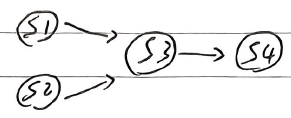
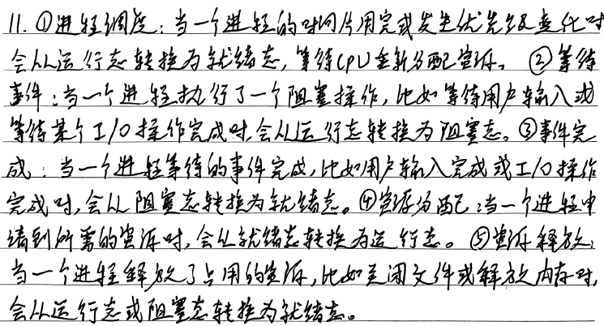
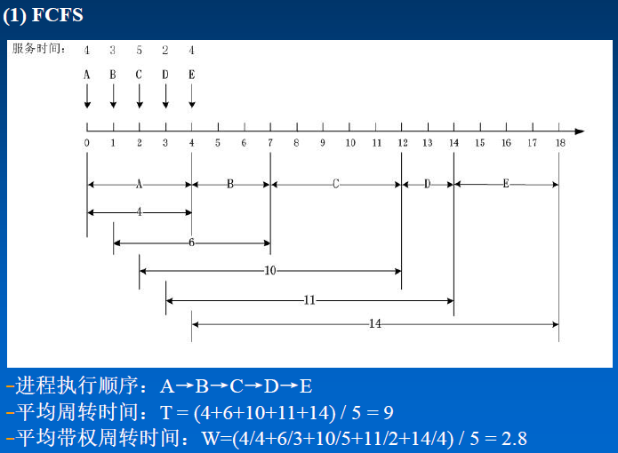
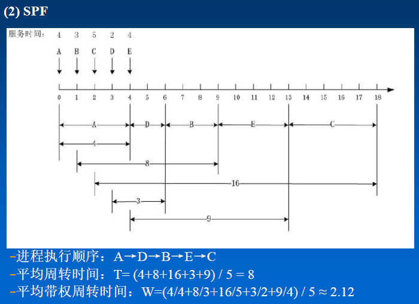

# 第一章 引论

## 习题

**6.试说明推动分时系统形成和发展的主要动力是什么？**

> <mark>人机交互</mark>、<mark>共享主机</mark>

**12.在多道程序技术的OS环境下的资源共享与一般情况下的资源共享有何不同？对独占资源应采取何种共享方式？**

> **多道程序技术的OS环境下的资源共享**：<mark>资源复用，多个并发进程对系统资源共同使用</mark>
> 
> **独占资源**：<mark>互斥共享方式</mark>（相对立的是`同时访问方式`，如磁盘、内存）

**20.什么是微内核OS？**

> 指精心设计的、能实现现代 OS 核心功能的<mark>小型内核</mark>，比一般的OS 更小更精炼，运行在核心态且开机后<mark>常驻内存</mark>，不会因为内存紧张而被换出内存。
> 
> 微内核OS采用<mark>客户机-服务器</mark>工作模式，提供各类操作系统服务。

# 第二章 进程管理

## 习题

**2.试画出下面四条语句的前趋图：**

    S1: a = x+y;

    S2: b = z+1;

    S3: c = a-b;

    S4: w = c+1;

> 

**3.为什么程序并发执行会产生间断性特征？**

> 由于<mark>资源共享、进程间合作</mark>，程序执行具有<mark>执行-暂停-执行</mark>的特点

**5.在操作系统中为什么要引入进程的概念？它会产生什么样的影响？**

> **为什么引入进程**：在多道程序环境下，<mark>程序的并发执行</mark>代替了程序的顺序执行，程序的活动不再处于封闭系统中，从而出现了许多新特征（`间断性`、`失去封闭性`、`不可再现性`）。为此人们引入了新概念——进程
> 
> **影响**：多个程序能并发执行、提高了<mark>资源利用率</mark>和<mark>系统吞吐量</mark>；进程控制块及协调各运行的机构带来<mark>内存开销</mark>；进程间切换、同步、通信带来<mark>时间开销</mark>

**9.进程控制块的组织方式有哪几种？**

> <mark>线性</mark>方式、<mark>链接</mark>方式、<mark>索引</mark>方式

**10.何谓操作系统内核？内核的主要功能是什么？**

> **操作系统内核**：现代操作系统将OS划分为<mark>若干层次</mark>。通常将一些与硬件紧密相关的模块、各种常用设备的驱动程序以及运行频率较高的模块都安排在<mark>紧靠硬件的软件层次</mark>中，将它们<mark>常驻内存</mark>，即OS内核。
> 
> **主要功能**：
> 
> - <mark>支撑功能</mark>：中断处理、时钟管理、原语操作
> 
> - <mark>资源管理功能</mark>：进程管理、存储器管理、设备管理

**11.试说明进程在三个基本状态之间转换的典型原因。**

> 

# 第三章 调度与死锁

## PPT例题

<mark>FCFS(First-Come, First-Served)</mark>：先来先服务

<mark>SPF(Shortest Process First)</mark>：短进程优先，`SJF`即短作业优先

> 

> 

> 不可化简，死锁

## 雨课堂

### 001-高响应比测试

#### 简答题

> <mark>HRRN(Highest Response Ratio Next)</mark>：高响应比优先调度算法
> 
> 响应比$R_p$：
> 
> $R_p = \frac{等待时间+要求服务时间}{要求服务时间}=\frac{响应时间}{要求服务时间}$

> 

> 

### 002-调度课堂测试

#### 选择题

> 2：<mark>MLQ（Multi-Level Queue）</mark>：多层队列调度算法

> 3：时间片轮转调度算法（<mark>round robin，RR</mark>）中，
> 
> $响应时间=T_{第一次被调度执行}-T_{提交到系统}$

#### 简答题

> 

*RR还不懂，下面是AI生成的*

> 

### 003-死锁课堂测试

#### 选择题

> 3：哲学家就餐？

> 4：
> 
> 

#### 简答题

> 

> 

## 习题

**1.高级调度与低级调度的主要任务是什么？为什么要引入中级调度？**

> 
> 
> **高级调度**：用于决定把<mark>外存上处于后备队列中的哪些作业调入内存</mark>，并为它们<mark>创建进程</mark>、<mark>分配必要的资源</mark>，再将<mark>新创建的进程排在就绪队列上</mark>，准备执行。
> 
> **低级调度**：用来决定<mark>就绪队列中的哪个进程应获得处理机</mark>，然后再由分派程序执行把处理机分配给该进程的具体操作。
> 
> **为什么引入中级调度**：为了<mark>提高内存利用率和系统吞吐量</mark>。为此，应把那些暂时不能运行的程序不再占用内存资源，将它们调至外存等待，把此时的进程状态改为就绪驻外存状态或<mark>挂起态</mark>。当它们已具备运行条件且内存又稍有空闲时，由中级调度来决定，把<mark>外存上的那些已具备运行条件的就绪进程再重新调入内存</mark>，并修改其状态为<mark>就绪态</mark>，挂在就绪队列上等待。

**6.为什么要引入高响应比优先调度算法？它有何优点？**

> 高响应比优先调度算法是一种高优先调度算法，系统将从后备队列中选择若干个响应比(优先权)最高的作业，装入内存，投入运行。
> 
> $R_p = \frac{等待时间+要求服务时间}{要求服务时间}=\frac{响应时间}{要求服务时间}$
> 
> **优点**：既照顾了<mark>短作业</mark>，又考虑了作业到达的先后次序 ，不会使<mark>长作业</mark>长期得不到服务。因此，该算法实现了一种较好的<mark>折衷</mark>。

**11.何谓静态和动态优先级？确定静态优先级的依据是什么？**

> 

**13.在时间片轮转法中，应如何确定时间片的大小？**

> 不可太大：影响<mark>最大响应时间</mark>
> 
> 不可太小：影响<mark>调度开销</mark>，增加<mark>周转时间</mark>

**20.按调度方式可将实时调度算法分为哪几种？**

> <mark>非抢占式调度算法</mark>、<mark>抢占式调度算法</mark>

> 

**23.何谓“优先级倒置”现象，可采取什么方法来解决？**

> **“优先级倒置”现象**：<mark>高优先级进程执行被延迟</mark>。
> 
> **如何解决**：<mark>优先级继承</mark>

**27.何谓死锁？产生死锁的原因和必要条件是什么？**

> **死锁**：
> 
> 指多个进程在运行过程中因<mark>争夺资源</mark>而造成的一种<mark>僵局</mark>。当进程处于这种僵局时，若无外力作用，他们都将无法再向前推进。
> 
> **原因**：
> 
> - <mark>争夺非剥夺性资源</mark>
>   
>   `非剥夺性资源`：必须在用完后才能被剥夺，如打印机
> 
> - <mark>进程推进顺序非法</mark>
> 
> **必要条件**：
> 
> - <mark>互斥条件</mark>
> 
> - <mark>请求和保持条件</mark>
> 
> - <mark>不剥夺条件</mark>
> 
> - <mark>环路等待条件</mark>

**30.在银行家算法的例子中，如果P0发出的请求向量由Request(0,2,0)改为Request(0,1,0)，问系统可否将资源分配给它？**

> 

**31.在银行家算法中，若出现下述资源分配情况，试问：**

(1)该状态是否安全？

(2)若进程P2提出请求Request(1,2,2,2)后，系统能否将资源分配给它？

> 

# 第四章 存储器管理

## 习题1

**7.为什么要引入动态重定位？如何实现？**

> **为什么引入动态重定位**：<mark>程序在运行过程中经常要在内存中移动位置</mark>，为了保证被移动了的程序还能正常执行，必须对数据的地址加以修改，即重定位。
> 
> **如何实现**：增设<mark>重定位寄存器</mark>，用它来存放程序在内存中的起始地址。程序执行时，物理地址是相对地址与重定位寄存器中的地址相加而来的。

**12.分区存储管理中常用哪些分配策略？比较它们的优缺点。**

> - **<mark>单一连续分配存储管理</mark>**
>   
>   - **优点**：实现简单，适用于单任务OS
>   
>   - **缺点**：有”内零头“
> 
> - **<mark>固定分区分配存储管理</mark>**
>   
>   - **优点**：实现简单
>   
>   - **缺点**：”内零头“严重
> 
> - **<mark>动态分区分配存储管理</mark>**（详见雨课堂004第五题）
>   
>   - 首次适应算法
>     
>     - 优点：高址端有大空闲区概率大
>     
>     - 缺点：低址端迅速划分，碎片出现速度快
>   
>   - 循环首次适应算法
>     
>     - 优点：碎片分布均匀
>     
>     - 缺点：高址端有大空闲区概率小
>   
>   - 最佳适应算法
>     
>     - 优点：容易保留大的空闲区
>     
>     - 缺点：碎片迅速出现
>   
>   - 最坏适应算法
>     
>     - 优点：碎片出现最慢、查找效率高
>     
>     - 缺点：“外零头”严重

**18.什么是页面？什么是物理块？页面的大小应如何确定？**

> **页面**：分页存储管理系统将用户程序的<mark>逻辑地址空间</mark>分成若干<mark>大小相等</mark>的片。
> 
> **物理块**：将<mark>内存空间</mark>分为若干个<mark>与页面大小相同</mark>的存储块。
> 
> **页面的大小如何确定**：应适中（过小：减小内存碎片、页表过长、页面换进换出开销大；过大：减少页表长度、提高页面换进换出速度、页内碎片增大），且页面大小应是2的幂，通常为1KB~8KB。

**19.什么是页表？页表的作用是什么？**

> **页表**：即<mark>页面映像表</mark>，设置在内存中，进程地址空间的所有页在页表中有一个<mark>页表项</mark>，记录了相应页在内存中对应的物理块号。
> 
> **作用**：实现<mark>从页号到物理块号的地址映射</mark>。

**22.具有快表时是如何实现地址转换的？**

> 
> 
> - 在每次需要访问逻辑地址中的数据时，先根据页号在<mark>快表</mark>中查看是否存在匹配的页表项
>   
>   - **若找到**，<mark>直接得到</mark>快表中相应的物理块号
>   
>   - **若没有找到**，<mark>访问页表</mark>寻找相应的页表项，得到相应的物理块号；同时，再将<mark>此页表项存入快表</mark>
> 
> - 物理块号送到地址寄存器中和页内地址结合<mark>形成物理地址</mark>

**26.分页和分段存储管理有何区别？**

> 

## 习题2

**2.什么是程序运行的时间局部性和空间局部性？**

> **时间局部性**：一条指令被执行了，则在<mark>不久的将来</mark>它可能再被执行；在一段时间内，访问的代码范围是有限的。
> 
> **空间局部性**：若某一存储单元被使用，在一定时间内，与<mark>该存储单元相邻的单元</mark>可能被使用。

**6.在请求分页系统中，页表应包括哪些数据项？每项的作用是什么？**

> - **<mark>页号</mark>**：用于标识页表中的<mark>特定页</mark>。
> 
> - **<mark>物理块号</mark>**：指明该页在物理内存中的具体位置，即对应的<mark>物理内存块号</mark>。
> 
> - **<mark>状态位P</mark>**：指示该页<mark>是否调入内存</mark>。
> 
> - **<mark>访问字段A</mark>**：用于记录本页在一<mark>段时间内被访问的次数</mark>，或记录本页最近已有<mark>多长时间未被访问</mark>。
> 
> - **<mark>修改位M</mark>**：标识该页在调入内存后<mark>是否被修改过</mark>。
> 
> - **<mark>外存地址</mark>**：指出该页在<mark>外存上的地址</mark>。

**8.试说明请求分页系统中的地址变换过程。**

> 首先<mark>检索快表</mark>，试图从中找出所要访问的页。
> 
> - **若找到**，修改表项中的<mark>访问字段A</mark>，供置换算法选换出页面时参考。对于<mark>写指令</mark>，还须把<mark>修改位M</mark>置“1”，表示该页在调入内存后已被修改。然后利用表项中所给出的物理块号和页内地址<mark>形成物理地址</mark>。
> 
> - **若未找到**，则到<mark>内存中查找页表</mark>，再从找到的页表项中的<mark>状态位P</mark>来了解该页是否已调入内存。
>   
>   - **若已调入内存**，将<mark>页表项写入快表</mark>（当快表已满时，先调出按某种算法所确定的页的页表项，再写入该页的页表项），修改<mark>访问字段A</mark>、<mark>修改位M</mark>。
>   
>   - **若尚未调入内存**，则<mark>产生缺页中断</mark>，请求OS从外存把该页调入内存。
> 
> 

**13.在一个请求分页系统中，采用FIFO页面置换算法时，假如一个作业的页面走向为4、3、2、1、4、3、5、4、3、2、1、5，当分配给该作业的物理块数M分别为3和4时，试计算在访问过程中所发生的缺页次数和缺页率，并比较所得结果。**

> 
> 
> 这里缺页率没*100%

**18.在请求分页系统中，产生“抖动”的原因是什么？**

> 同时在系统中运行的进程太多，由此分配给每一个进程的<mark>物理块太少</mark>，不能满足进程正常运行的基本要求，致使每个进程在运行时，频繁地出现缺页，必须请求系统将所缺之页调入内存。

**19.何谓工作集？它是基于什么原理确定的？**

> **工作集**：在<mark>某段时间间隔</mark>里，进程<mark>实际所要访问页面</mark>的<mark>集合</mark>。
> 
> **原理**：用程序<mark>过去</mark>某段时间内的行为作为程序在<mark>将来</mark>某段时间内行为的<mark>近似</mark>。

**24.说明请求分段系统中的缺页中断处理过程。**（这里要求的是“自学”=_=）

> 

## PPT例题

> 
> 
> 
> 
> 

## 雨课堂

### 004-连续分区分配测试(10.23)

*这里题目不公开了，只有大题答案*

*牛逼，通过搜题记录找到了*

#### 选择题

> 1：
> 
> 
> 
> **绝对装入**：<mark>编译后</mark>即产生物理地址。
> 
> **静态重定位/重定位**：在<mark>装入时</mark>对目标程序中指令和数据地址进行修改。
> 
> **动态重定位**：程序真正要<mark>执行时</mark>才进行地址变换

> 4:
> 
> 

> 5:
> 
> - **首次适应**
>   
>   按<mark>地址递增</mark>顺序排列空闲分区链；分配内存时，总是<mark>从低地址端开始</mark>扫描空闲区；找到的第一个大小合适的分区，就分割分配；否则失败。
>   
>   **特点**：高址端有大空闲区概率大；低址端迅速被划分，碎片出现速度快；
> 
> - **循环适应（循环首次适应）**
>   
>   按<mark>地址递增</mark>顺序排列空闲分区链；设置<mark>当前指针</mark>；分配内存时，从<mark>指针所指位置开始</mark>扫描空闲区；找到的第一个大小合适的分区，就分割分配；否则失败。
>   
>   本质是CLOCK算法
>   
>   **特点**：碎片分布均匀；高址端有大空闲区概率小；
> 
> - **最佳适应**
>   
>   按<mark>大小递增</mark>顺序排列空闲分区链；分配内存时，从<mark>链首开始</mark>扫描空闲区；找到的第一个大小合适的分区，就分割分配；否则失败。
>   
>   **特点**：碎片迅速出现；“最佳”匹配；
> 
> - **最坏适应**
>   
>   按<mark>大小递减</mark>顺序排列空闲分区链；分配内存时，总是<mark>分配链首</mark>空闲区（分割一部分）；否则失败。
>   
>   **特点**：碎片出现最慢（分割后剩下的分区是最大的）、查找效率高；“最坏”匹配；
> 
> 6：
> 
> <mark>**内零头**：分配给进程，而进程未用到的内存部分</mark>
> 
> <mark>**外零头**：未分配给进程，但因为太小而无进程能用</mark>
> 
> **单一连续分配**：
> 
> - 简单
> 
> - 适用于单任务OS
> 
> **固定分区分配**：
> 
> - 最早的支持多道程序设计的存储管理方案
> 
> - 简单，现在仍在嵌入式系统中使用
> 
> - “内零头”严重
> 
> **动态分区分配**：见5题的4个动态分区分配解释

> **C**，<mark>交换</mark>也称<mark>对换</mark>

#### 简答题

> 
> 
> 第3问也可以是
> 
> $(10ns+200ns)\times90\% + (10ns+200ns+200ns)\times(1-90\%)=230ns$

****

> **首次适应分配算法**每次分配都是<mark>从低址到高址</mark>。
> 
> 空闲区内存大小依次为：15KB, <u>1KB</u>, 115KB, 30KB, <u>5KB</u>, 8KB, <u>2KB</u>
> 
> 其中划线的为<u>外零头</u>，无法装入任意作业。
> 
> 要能装入这四个作业：
> 
> - 15KB空闲区分配给J2（不能给J1）
> 
> - 115KB空闲区分配给J4（不能给J1、J2、J3）
> 
> - 30KB空闲区分配给J3（不能给J1、J2）
> 
> - 8KB空闲区分配给J1
> 
> 因此，J1只能最后装入；J4不能晚于J3；
> 
> **(1)答案有误**，可用顺序为：
> 
> - J4,J3,J2,J1
> 
> - J2,J4,J3,J1
> 
> - J4,J2,J3,J1
> 
> - J4,J3,J2,J1

> 

### 005-离散分区分配测试(10.28)

*同上*

#### 选择题

> 1:
> 
> **B、C、D**
> 
> 分页、分段、段页式
> 
> 2：
> 
> **位视图**用于文件系统

> 3:
> 
> **B**
> 
> **页面大小**1KB=2^10Byte，按字节编址，**页内地址**需要**10位**
> 
> 16位地址的分页系统即：15~10位为页号；9~0位为页内地址
> 
> 逻辑地址0x35F7用二进制表示为0011 0101 1111 01111
> 
> 页号即001101=13
> 
> 4:
> 
> **C**
> 
> 页面数=65536/4096=16页
> 
> 对于正文：所需页面=32768/4096=8页
> 
> 对于数据：所需页面=16386/4096=4页...2字节，实际需要5页
> 
> 对于堆栈：所需页面=15870/4096=3页...3582字节，实际需要4页
> 
> 4+5+8=17页

> 6:
> 
> **A、C、D**
> 
> 分页没有分段、段页式方便

> 7：
> 
> **A、B、C、D**
> 
> 

#### 简答题

> 页号有256个即2^8，占8位，页面大小为1M/256=2^12Byte，页内地址需要12位
> 
> 所以逻辑地址需要20位表示
> 
> 

### 007-虚拟内存

#### 选择题

#### 简答题

> 

> 

# 期末课堂测试

